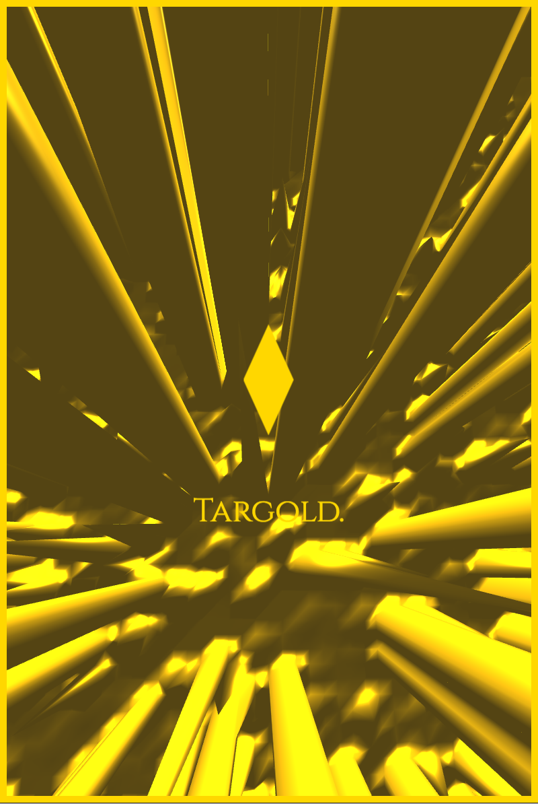

# XGold ✨ 🔑

## Contract: 0x876BCa49BD8E4667d295363Fd2028142C7ba396C

Every Block is a Diamond.

# Installation

To purchase or trade CPs (counterparts) a Ethereum Node must be run.

Run Geth with a RPC API:

```javascript
geth --rpc
```

Alternatively run Chrome with the [Metamask](https://metamask.io/) Extension:


# Usage


## Configuration

#status
continue here:
https://github.com/ethereum/go-ethereum/issues/1623


-24/6/17:

TODO TX Data mus fit into diamondsqaure !!

works with data from remote api (etherchain)
(meaning purchasing not possible)

works with data from metamask
(INCOMING DATA IS NOT SORTED data needs to be sorted for diamond square)

works with data from local running node
(INCOMING DATA IS NOT SORTED data needs to be sorted for diamond square)





# resources

deploying contracts
https://www.youtube.com/watch?v=eWclxmGjYb4

metamask
https://github.com/MetaMask/faq/blob/master/DEVELOPERS.md#dizzy-all-async---think-of-metamask-as-a-light-client

web3.js
https://github.com/ethereum/web3.js/

#jewelry commercials:

https://www.youtube.com/watch?v=Kxpe0nOXQsg

https://www.youtube.com/watch?v=8Fosqx2C_A8

#de beers
https://www.youtube.com/watch?v=uUzmUH55iKo&list=PLEqf8pU7tcmaLTRdrvustF86iJXX2uBi6#t=3.633411

#banks

https://www.youtube.com/watch?v=Qbz95LdqMko

https://www.youtube.com/watch?v=6xHb0A4Sndw

https://www.youtube.com/watch?v=IvKt98rPkg8

#fonts

http://www.dafont.com/de/florencesans.font?text=1234567890

http://www.dafont.com/de/market-fresh.font?text=1234567890

HELVETICA

ARIAL
