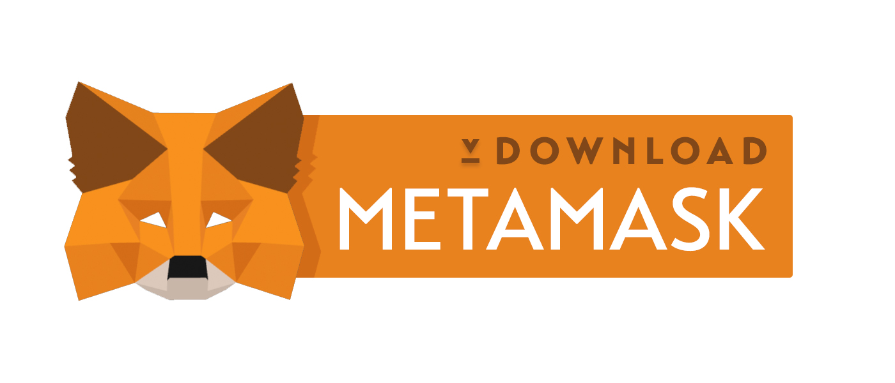
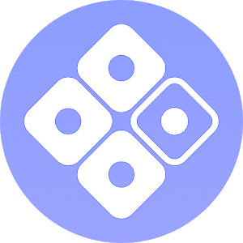

# <p align="center">🔑 XGold 🔑<br/> A Decentralized App<br/> For Digital  Gold Trading<br/>On The Ethereum Blockchain ✨</p>

# <p align="center">Online <a href="https://xgold.cc">xgold.cc</a></p>

[](https://ethereum.org)
[](https://ethereum.org) [](https://github.com/florianmaxim/xgold/issues) [](https://github.com/florianmaxim/xgold) 


## <p align="center">We give crypto currencies the counterparts fiat money has lost.</p><p align="center">Build out of their own heart.<p align="center">The Blockchain.</p>

<p align="center">
 
</p>

## <p align="center">Once purchased, a block turns into gold and will always be yours. </p><p align="center">The Blockchain never forgets.</p>

<p align="center">
 
</p>

## <p align="center">As long as the Blockchain exists there will be blocks waiting for you to be turned into gold.</p>

<p align="center">
 
</p>

## <p align="center">XGold requires a connection to the Ethereum blockchain.</p>

### <p align="center">Don't worry, there is gold left. You'll be online in a sec. Here's how:</p>

# <p align="center">Desktop</p>

## <p align="center">On desktop devices the great Fox and his Metamask provide you access to the network :</p>

<p align="center">
    <a target="_blank" href="https://chrome.google.com/webstore/detail/metamask/nkbihfbeogaeaoehlefnkodbefgpgknn?hl=en">
    
    </a>
</p>

# <p align="center"> Set up and browse to <a href="https://xgold.cc">xgold.cc</a></p>

# <p align="center">Mobile</p>

## <p align="center">On mobile devices the awesome Chiper Browser grants to you access to the blockchain :</p>

<p align="center">
</img>
</p>

<p align="center">
    <a target="_blank" href="https://itunes.apple.com/app/cipher-browser-for-ethereum/id1294572970?ls=1&mt=8">
    
    </a> <a target="_blank" href="https://play.google.com/store/apps/details?id=com.cipherbrowser.cipher">
    
    </a>
</p>

# <p align="center"> Set up and browse to <a href="https://xgold.cc">xgold.cc</a></p>

# Stats 
[](https://ethereum.org)
[](https://ethereum.org) [](https://github.com/florianmaxim/xgold/issues) [](https://github.com/florianmaxim/xgold) 


### Contract: 0x876BCa49BD8E4667d295363Fd2028142C7ba396C

# Requirements

[NodeJS](https://nodejs.org) must be installed.

# Installation

To **trade** CPs a Ethereum Node must be run.

Run Geth with a RPC API:

```javascript
geth --rpc
```

Alternatively run Chrome with the [Metamask](https://metamask.io/) Extension:

On mobile devices use [Cipher](https://www.cipherbrowser.com/).

To **view** CPs only no Ethereum node is necessary:

If no Ethereum node is provided the Blockchain data is provided by public APIs:

#1 [Blockcypher](https://www.blockcypher.com/dev/ethereum/#introduction)
```javascript
https://api.blockcypher.com/v1/eth/main
```

# Usage

## Run

### Develop

```javascript
npm run dev
```

### Build

```javascript
npm run build
``` 

### Start

```javascript
npm start
```

Browse to **[localhost:8080](http://localhost:8080)**.

## Configuration


# Resources & Inspiration

## Jewelry commercials:

https://www.youtube.com/watch?v=Kxpe0nOXQsg

https://www.youtube.com/watch?v=8Fosqx2C_A8

## De Beers
https://www.youtube.com/watch?v=uUzmUH55iKo&list=PLEqf8pU7tcmaLTRdrvustF86iJXX2uBi6#t=3.633411

## Banks

https://www.youtube.com/watch?v=Qbz95LdqMko

https://www.youtube.com/watch?v=6xHb0A4Sndw

https://www.youtube.com/watch?v=IvKt98rPkg8

# License

## MIT


<p align="center">
 
</p>

## <p align="center">Well, gold is fascinating.</p><p align="center">But have you every heard about nebulas on the blockchain?</p>